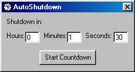



## AutoShutdown

### Description

AutoShutdown is an application to shutdown your PC after a fixed time. It does not need any configuration and all you need is enter the time after you want your PC to shutdown. AutoShutdown can also be minimized to the system tray.
 
### More Info
 

             |
---                |---
**Submitted On**   |2001-08-26 00:45:12
**By**             |[Saurabh Gupta](https://github.com/Planet-Source-Code/PSCIndex/blob/master/ByAuthor/saurabh-gupta.md)
**Level**          |Intermediate
**User Rating**    |4.7 (14 globes from 3 users)
**Compatibility**  |VB 5\.0, VB 6\.0
**Category**       |[Complete Applications](https://github.com/Planet-Source-Code/PSCIndex/blob/master/ByCategory/complete-applications__1-27.md)
**World**          |[Visual Basic](https://github.com/Planet-Source-Code/PSCIndex/blob/master/ByWorld/visual-basic.md)
**Archive File**   |[AutoShutdo253278252001\.zip](https://github.com/Planet-Source-Code/saurabh-gupta-autoshutdown__1-26643/archive/master.zip)

